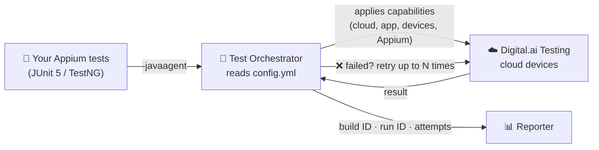
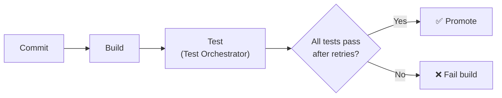

<div align="center">

# Digital.ai Test Orchestrator

**Retry flaky Appium tests automatically, run only the tests you need, and control everything from one YAML file, without changing your test code.**


[What it is](#-what-is-test-orchestrator) •
[Quick start](#-quick-start) •
[Configuration](#%EF%B8%8F-configuration-reference) •
[Features](#-features-in-detail) •
[CI/CD](#-cicd-integration) •
[Troubleshooting](#-troubleshooting)

</div>

---

## 🧭 What is Test Orchestrator?

Test Orchestrator sits between your Appium tests and the **Digital.ai Testing** platform. It controls how your tests run and retries failures automatically. You don't need to change your tests, or restart a test run manually.

> **The short version:** Your team already runs Appium tests on Digital.ai Testing. Test Orchestrator controls how those tests run. It retries failures automatically and shows every attempt in Reporter. Your team spends less time rerunning tests by hand, and has a clearer place to start when something fails. **Your test methods stay as they are.**

### Why it exists

As a test suite grows (and AI helps teams write even more tests), regression runs start failing for reasons that aren't obvious. Teams may lose hours rerunning failed tests by hand just to learn whether a failure **repeats** (a real defect) or was **temporary** (a flaky device, e.g., a network blip). Test Orchestrator does that rerunning for you, while also making the setting of capabilities easier by centralizing them.

### What it is, in one table

| | |
|---|---|
| 📦 **A Java agent** | A single JAR, attached to your existing test run with `-javaagent`. No SDK to code against. |
| 📝 **One YAML file** | Cloud connection, app, device selection, retries, and which tests to run all live in `config.yml`. |
| 🔁 **Automatic retries** | Failed tests are rerun up to *N* times. Every attempt is visible in Reporter. |
| 🎯 **Test selection** | Run one class or one method from config. You don't need to edit test suites or build files. |
| 🛑 **Fail fast** | When a critical test fails, Test Orchestrator skips the tests that would fail anyway. |


### How it works



Test Orchestrator runs as a **JVM agent**. At runtime it hooks into the test runner (JUnit / TestNG) and the Appium driver. When a test starts, it applies the capabilities from your YAML file on top of any capabilities your test already sets. It then decides which tests run, retries any that fail, and reports each attempt to Reporter.

---

## ✅ Prerequisites

| Requirement | Supported |
|---|---|
| **Java** | 17 or 21 |
| **Build tool** | Gradle or Maven |
| **Test framework** | JUnit 5 (Jupiter) or TestNG 7+ |
| **Appium Java client** | 8, 9 or 10 (set in your project's dependencies, **not** in YAML) |
| **Digital.ai Testing** | A cloud URL and an [access key](https://docs.digital.ai/continuous-testing/docs/te/test-execution-home/smart-agent) |
| **Test Orchestrator JAR** | Ask your Digital.ai representative or the [Support Portal](https://support.digital.ai/hc/en-us) |

---

## 📁 What's in this repo

```
.
├── lib/
│   ├── smart-agent-1.0-SNAPSHOT.jar   ← the Test Orchestrator agent
│   ├── config.example.yml             ← template: copy to config.yml
│   └── config.yml                     ← your real config (git-ignored, holds your key)
├── src/test/java/tests/
│   ├── LoginScenariosTest.java        ← 3 example tests (1 fails on purpose)
│   └── PaymentScenariosTest.java      ← 3 example tests (1 fails on purpose)
├── build.gradle.kts                   ← attaches the agent to the `test` task
└── smart-agent/<run-id>/              ← generated: one log folder per run
```

> 💡 The example tests are deliberately simple: a driver session plus a basic assertion. To keep them short, they set only the test name and leave the cloud URL, access key, app and devices to `config.yml`. Your own tests can keep their existing capabilities. See [Capabilities in code vs. YAML](#-capabilities-in-code-vs-yaml). `edge_case_login_test` and `edge_case_payment_test` **fail on purpose**, so you can watch the retries happen.

---

## 🚀 Quick start

### 1. Clone the repo

```bash
git clone <this-repo-url>
cd SmartAgentTest
```

### 2. Create your config and add your cloud details

```bash
cp lib/config.example.yml lib/config.yml
```

Then edit `lib/config.yml`:

```yaml
cloud:
  url: https://<YOUR_CLOUD_HOST>/wd/hub
  accessKey: <YOUR_ACCESS_KEY>
```

> 🔐 `lib/config.yml` is already in `.gitignore`, so your key stays local. See [Keeping credentials safe](#-keeping-credentials-safe).

### 3. Attach the agent (already done in this repo)

The only build change you need is one JVM argument on the test task. It takes the form `-javaagent:<agent.jar>=<config.yml>`:

```kotlin
// build.gradle.kts
tasks.test {
    jvmArgs(
        "-javaagent:${projectDir}/lib/smart-agent-1.0-SNAPSHOT.jar=${projectDir}/lib/config.yml",
        "-Dbuild.id=${System.getenv("BUILD_ID") ?: "local"}"
    )
    useTestNG()
}
```

> 🧪 **This repo uses TestNG.** Using **JUnit 5** instead? The agent setup is the same: swap `useTestNG()` for `useJUnitPlatform()` and add the JUnit dependencies. [Here's how to set it up for JUnit in the docs →](https://docs.digital.ai/continuous-testing/docs/te/test-execution-home/smart-agent#step-5-update-your-gradle-test-task)
>
> 📦 **Using Maven instead of Gradle?** You attach the agent the same way, through Surefire's `argLine`. [See the Maven example below →](#maven-setup) Maven is a [supported build tool](https://docs.digital.ai/continuous-testing/docs/te/test-execution-home/smart-agent), but the docs only show Gradle examples.

### 4. Run your tests the way you always do

```bash
./gradlew test
```

### 5. Check the results in Reporter

Open **Reporter** in Digital.ai Testing and filter by your **Build ID**. Each failing test now shows several attempts:

```text
edge_case_payment_test   Attempt 1 ❌  →  Attempt 2 ❌  →  Attempt 3 ❌   ⇒ consistent failure, likely a real defect
positive_payment_test    Attempt 1 ✅                                   ⇒ passed, no retry needed
```

When a test fails on attempt 1 and passes on attempt 2, that's a **flaky** test. When it fails on every attempt, look at it as a **real** failure.

---

## ⚙️ Configuration reference

Everything is controlled from `config.yml`. Change the app version, the devices, the retries or the tests to run **without touching any test code.**

### 🧩 Capabilities in code vs. YAML

**You don't have to remove capabilities from your existing tests.** Any capabilities your tests set in code still work. When `config.yml` sets the same setting, **the YAML value overrides the one in code**.

| Your test sets it | `config.yml` sets it | Value used |
|:---:|:---:|---|
| ✅ | ❌ | The value from your test code |
| ❌ | ✅ | The value from `config.yml` |
| ✅ | ✅ | **The value from `config.yml`** (YAML wins) |

So you can adopt Test Orchestrator without touching your tests, then move settings into YAML gradually. For example, start by setting only `deviceQuery` in the YAML so you can switch devices for every test from one place, and leave everything else as it is.

```yaml
# ─── Where to run ──────────────────────────────────────────────
cloud:
  url: https://<YOUR_CLOUD_HOST>/wd/hub        # Required
  accessKey: <YOUR_ACCESS_KEY>            # Required

# ─── What to test ──────────────────────────────────────────────
app:
  ios:
    app: cloud:com.experitest.ExperiBank  # App already uploaded to the cloud
    bundleID: com.experitest.ExperiBank
    # appBuildVersion:                    # Optional: pin a build
    # appReleaseVersion:                  # Optional: pin a release
  # android:
  #   app: cloud:com.experitest.ExperiBank/.LoginActivity
  #   packageName: com.experitest.ExperiBank
  #   activity: .LoginActivity
  #   appBuildVersion:
  #   appReleaseVersion:

# ─── Which devices ─────────────────────────────────────────────
deviceQuery:
  iosQuery:
    deviceQuery: "@os='ios'"              # e.g. "@os='ios' and @version>='18.0'"
  # androidQuery:
  #   deviceQuery: "@os='android' and @category='PHONE'"
  # devicePool: SHARED

# ─── Appium server version ─────────────────────────────────────
appium:
  appiumVersion: 3.5.2

# ─── How to run ────────────────────────────────────────────────
run:
  maxRetryAttempts: 2                     # Retries per failed test (default: 0)
  testSelection:                          # Empty = run everything
    # - tests.LoginScenariosTest                         # a whole class
    # - tests.PaymentScenariosTest#edge_case_payment_test  # a single method
  # criticalTests:                        # Fail fast (see below)
  #   - tests.LoginScenariosTest#positive_login_test
  # skipReportBatchSize: 20
```

### Key-by-key

| Key | Required | What it does |
|---|:---:|---|
| `cloud.url` | ✅ | Your Digital.ai Testing Appium endpoint. |
| `cloud.accessKey` | ✅ | Your access key for authentication. |
| `app.ios.app` / `app.android.app` | | The app to install, using `cloud:<bundleId>` or `cloud:<uniqueName>`. |
| `app.ios.bundleID` / `app.android.packageName` | | The app identifier. |
| `app.android.activity` | | The launch activity, e.g. `.LoginActivity`. |
| `app.*.appBuildVersion` / `appReleaseVersion` | | Pins a specific uploaded version of the app. |
| `deviceQuery.iosQuery.deviceQuery` / `androidQuery.deviceQuery` | | A device query in the standard Digital.ai query syntax. |
| `deviceQuery.devicePool` | | The device pool to use, e.g. `SHARED`. |
| `appium.appiumVersion` | | The Appium **server** version used in the cloud. |
| `run.maxRetryAttempts` | | How many times a **failed** test is retried. Default is `0`. |
| `run.testSelection` | | Classes (`ClassName`) or methods (`ClassName#method`) to run. Leave empty to run all tests. |
| `run.criticalTests` | | Methods that trigger [fail fast](#-fail-fast-for-critical-tests) when they fail. |
| `run.skipReportBatchSize` | | How many skipped tests are reported to Reporter per batch. Default is `20`. |

> ⚠️ **YAML is sensitive to indentation.** Use spaces, not tabs. If a run behaves unexpectedly, validate the file first.

---

## 🔍 Features in detail

### 🔁 Automatic retries

Set `run.maxRetryAttempts`. Test Orchestrator **only retries tests that fail**. Tests that pass run once. Every attempt is reported separately, so you can see the full history of each test in one place.

| Pattern in Reporter | What it usually means |
|---|---|
| ❌ → ✅ | **Flaky.** Something in the environment, the network or the timing. Worth stabilizing, but not a product bug. |
| ❌ → ❌ → ❌ | **Consistent failure.** Likely a real defect. Start debugging here. |

### 🎯 Selective test execution

Run part of your suite without editing TestNG XML files, JUnit tags or build scripts:

```yaml
run:
  testSelection:
    - tests.LoginScenariosTest                          # whole class
    - tests.PaymentScenariosTest#edge_case_payment_test   # single method
```

### 🛑 Fail fast for critical tests

When a critical test fails (for example, login), the tests after it will usually fail too. Fail fast stops those cascading failures:

```yaml
run:
  criticalTests:
    - tests.LoginScenariosTest#positive_login_test   # must be Class#method; whole classes aren't supported
  skipReportBatchSize: 20
```

When a critical test **still fails after all its retries**, Test Orchestrator:

1. Lets the tests that are already running finish.
2. Stops starting new tests.
3. Marks the remaining tests as **Skipped**, with the reason *"Skipped due to critical test failure: &lt;TestCaseID&gt;"*.

Skipped tests are never retried, and they have no steps, video or logs. Tests that already finished keep their status.

> ℹ️ The Reporter property `smart-agent.skip-tests-batch-size` (default `20`) must be **greater than or equal to** `skipReportBatchSize`, or batch requests will fail.

### 🔄 Test status sync (automatic)

Sometimes the Appium session status and your framework's result disagree. For example, an assertion fails after the session ends, or a driver exception is caught on purpose. Test Orchestrator makes the **Reporter status match what JUnit/TestNG reported**. This needs no configuration. Screenshots, videos and logs aren't changed.

### 🏷️ Build ID & Run ID

| ID | Scope | Where it comes from |
|---|---|---|
| **Build ID** | Every test in one CI/CD build | You set it with `-Dbuild.id=<value>` |
| **Run ID** | One Test Orchestrator run | Generated automatically and printed at startup |
| **Test Case ID** | One test across all runs | Generated automatically. Use it to track a test's stability over time. |
| **Attempt** | One try of a test within a run | 1, 2, 3, … |

In Reporter, filter by any of these to compare runs, focus on one build, or see how stable a test has been over time.

---

## 🔗 CI/CD integration

Test Orchestrator acts as a **quality gate** in your pipeline's test stage:



Pass your CI build number as the Build ID, so all of a build's results are grouped together in Reporter. The `build.gradle.kts` above reads it from the `BUILD_ID` environment variable.

<details>
<summary><b>GitHub Actions</b></summary>

```yaml
- uses: actions/setup-java@v4
  with:
    distribution: temurin
    java-version: '21'
- name: Run tests with Test Orchestrator
  env:
    BUILD_ID: ${{ github.run_number }}
  run: ./gradlew test
```
</details>

<details>
<summary><b>Jenkins</b></summary>

```groovy
stage('Test') {
    steps {
        // Jenkins already exposes BUILD_ID
        sh './gradlew test'
    }
}
```
</details>

<a id="maven-setup"></a>
<details>
<summary><b>Maven (Surefire)</b></summary>

Attach the agent through Surefire's `argLine`. This works with both TestNG and JUnit 5, because Surefire picks the right test provider from your dependencies:

```xml
<plugin>
  <groupId>org.apache.maven.plugins</groupId>
  <artifactId>maven-surefire-plugin</artifactId>
  <configuration>
    <argLine>
      -javaagent:${project.basedir}/lib/smart-agent-1.0-SNAPSHOT.jar=${project.basedir}/lib/config.yml
      -Dbuild.id=${env.BUILD_ID}
    </argLine>
  </configuration>
</plugin>
```

```bash
mvn test
```
</details>

---

## 🔐 Keeping credentials safe

`config.yml` contains your access key, so treat it like a secret:

- This repo commits only `lib/config.example.yml`, which has placeholders. The real `lib/config.yml` is git-ignored.
- In CI, create `config.yml` in a pipeline step that pulls the key from your secrets manager (for example GitHub Secrets or Jenkins Credentials):

  ```yaml
  # GitHub Actions
  - name: Create config.yml
    env:
      DAI_ACCESS_KEY: ${{ secrets.DAI_ACCESS_KEY }}
    run: sed "s|<YOUR_ACCESS_KEY>|$DAI_ACCESS_KEY|" lib/config.example.yml > lib/config.yml
  ```
- Keep the access key out of your test code too. Test Orchestrator supplies it from `config.yml`.
- If a key is ever committed, **rotate it**. Deleting it from git history isn't enough.

---

## 📜 Logs

Each run writes a detailed log to:

```
smart-agent/<run-id>/smartagent-main.log
```

The log shows which config was loaded, which frameworks were detected (Java, JUnit, TestNG, Appium), each test's lifecycle, retry attempts, and failure reasons. Look here first when something doesn't behave as expected. `smart-agent/` is already in this repo's `.gitignore`.

---

## 🛠️ Troubleshooting

| Symptom | Check |
|---|---|
| Agent doesn't seem to run | Is the `-javaagent` path correct and absolute (or built from `${projectDir}`)? Is the JAR present? |
| Config not applied | Does the path after `=` point to the right `config.yml`? Check the log for `Configuration loaded successfully`. |
| Strange or ignored settings | YAML indentation. Use spaces only and validate the file. |
| `NoSuchMethodError` / instrumentation errors in the log | Check you're on Java 17/21 and Appium java-client 8–10, and look for conflicting `byte-buddy` versions on the test classpath. |
| Retries don't happen | Is `run.maxRetryAttempts` greater than `0`? Only **failed** tests are retried. |
| Fail-fast batch errors | Make sure `smart-agent.skip-tests-batch-size` in Reporter is ≥ `skipReportBatchSize`. |
| Results hard to find in Reporter | Filter by **Build ID**, which comes from `-Dbuild.id`. |

---

## 📚 Learn more

- [Test Orchestrator overview](https://docs.digital.ai/continuous-testing/docs/te/test-execution-home/smart-agent)
- [YAML configuration](https://docs.digital.ai/continuous-testing/docs/te/test-execution-home/smart-agent/smart-agent-yaml-config)
- [CI/CD integration](https://docs.digital.ai/continuous-testing/docs/te/test-execution-home/smart-agent/smart-agent-ci-cd-integration)
- [Viewing results in Reporter](https://docs.digital.ai/continuous-testing/docs/te/test-execution-home/smart-agent/view-test-results-in-test-reporter)
- [Test status update](https://docs.digital.ai/continuous-testing/docs/te/test-execution-home/smart-agent/test-status-sync-smart-agent)
- [Fail fast for critical tests](https://docs.digital.ai/continuous-testing/docs/te/test-execution-home/smart-agent/fail-fast-critical-tests)

> 📝 The official docs use the earlier name **Smart Agent**. It's the same product as Test Orchestrator.

---

<div align="center">
<sub>Built for teams running Appium on <b>Digital.ai Testing</b>. Questions? Contact your Digital.ai representative.</sub>
</div>
